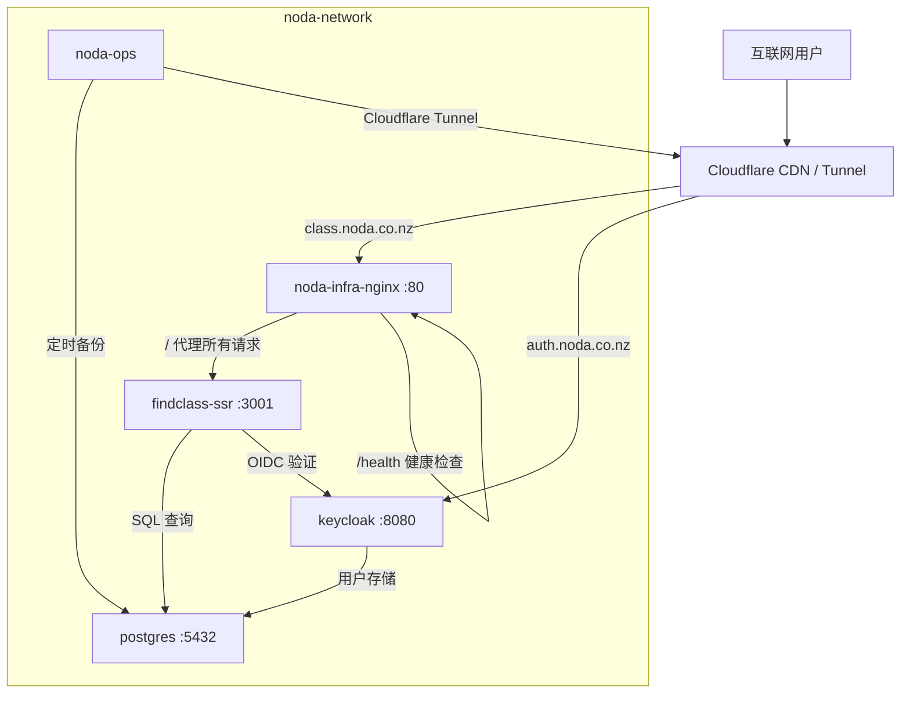

<!-- generated-by: gsd-doc-writer -->

# 系统架构

## 系统概述

Noda 基础设施是一个基于 Docker Compose 的多层部署系统，为新西兰教育平台 Noda 提供 PostgreSQL 数据库、Keycloak 身份认证、Nginx 反向代理和 Cloudflare Tunnel 内网穿透等服务。系统采用分层架构（Cloudflare CDN 层、Nginx 反向代理层、应用服务层、数据存储层），通过外部网络 `noda-network` 连接所有容器，仅 Nginx 容器暴露端口，确保最小攻击面。

## 组件图



## 数据流

### 用户访问应用（class.noda.co.nz）

1. 用户浏览器发起请求 `https://class.noda.co.nz/`
2. Cloudflare CDN 接收请求，通过 Cloudflare Tunnel 转发到内网 `noda-infra-nginx:80`
3. Nginx 根据 `server_name` 匹配 `class.noda.co.nz`，将所有请求通过 `proxy_pass` 转发到 `findclass-ssr:3001`
4. findclass-ssr 根据请求类型处理：
   - **静态资源**：直接返回构建产物中的文件
   - **API 请求**（`/api/*`）：Express API 处理业务逻辑，查询 PostgreSQL 数据库
   - **SSR 页面**：服务端渲染 React 页面后返回 HTML
5. 如果请求需要认证，findclass-ssr 通过 Keycloak OIDC 协议验证用户身份

### 用户认证流程（auth.noda.co.nz）

1. 用户浏览器访问 `https://auth.noda.co.nz/`
2. Cloudflare CDN 接收请求，通过 Tunnel 转发到 `keycloak:8080`
3. Keycloak 处理登录/注册/OAuth 等认证请求
4. 认证成功后 Keycloak 设置 cookie 并重定向回应用

### 数据库备份流程

1. noda-ops 容器通过 supervisord 管理 cron 和 cloudflared 两个进程
2. cron 每天凌晨 3:00 执行 `backup-postgres.sh`，使用 `pg_dump` 备份 PostgreSQL
3. 备份文件通过 rclone 上传到 B2 云存储（`scripts/backup/lib/` 提供指标收集和工具函数）
4. 每周日凌晨 3:00 执行 `test-verify-weekly.sh` 验证备份完整性

## 关键抽象

| 组件 | 说明 | 配置文件 |
|------|------|----------|
| Docker Compose 项目 | 统一管理所有服务，项目名 `noda-infra` | `docker/docker-compose.yml` |
| Overlay Compose 文件 | 生产环境覆盖配置（资源限制、SMTP 等） | `docker/docker-compose.prod.yml` |
| 外部 Docker 网络 | `noda-network`，跨 compose 文件共享 | 所有 `docker-compose*.yml` 中定义 |
| Nginx server blocks | 按域名路由请求到不同后端服务 | `config/nginx/conf.d/default.conf` |
| Nginx snippets | 复用的代理头配置，区分普通请求和 WebSocket | `config/nginx/snippets/proxy-common.conf`、`proxy-websocket.conf` |
| Supervisord | noda-ops 容器内管理 cron 和 cloudflared 多进程 | `deploy/supervisord.conf` |
| Vite 构建参数 | `VITE_*` 变量在 `docker build` 时写入前端 JS，运行时不可更改 | `deploy/Dockerfile.findclass-ssr` |
| Keycloak Hostname SPI v2 | 使用 `KC_HOSTNAME` 完整 URL 配置，自动从 scheme 推导端口 | `docker/docker-compose.yml` keycloak 服务 |
| SOPS + age | 密钥加密方案，敏感配置存储在 `config/secrets.sops.yaml` | `.sops.yaml`、`config/secrets.sops.yaml` |
| Cloudflare Tunnel | 通过 token 认证建立隧道，ingress 规则按域名路由 | `config/cloudflare/config.yml` |

## 目录结构说明

```
noda-infra/
├── config/                    # 所有运行时配置文件
│   ├── nginx/                 # Nginx 主配置、server blocks、snippets
│   ├── cloudflare/            # Cloudflare Tunnel ingress 规则
│   ├── environments/          # .env.example 和 .env.production.template
│   ├── keys/                  # age 加密密钥（不提交到 Git）
│   ├── secrets.sops.yaml      # SOPS 加密的敏感配置
│   └── secrets.local.yaml     # 本地解密配置（不提交到 Git）
├── deploy/                    # Dockerfile 和容器启动脚本
│   ├── Dockerfile.findclass-ssr  # 前端+API 多阶段构建（node:20-alpine）
│   ├── Dockerfile.noda-ops       # 运维工具集镜像（alpine:3.19）
│   ├── Dockerfile.backup         # 备份服务独立镜像
│   ├── supervisord.conf          # noda-ops 进程管理配置
│   ├── entrypoint-ops.sh         # noda-ops 启动初始化脚本
│   └── crontab                   # 备份定时任务定义
├── docker/                    # Docker Compose 文件和运行时数据
│   ├── docker-compose.yml     # 基础服务定义（所有环境共享）
│   ├── docker-compose.prod.yml # 生产环境覆盖
│   ├── docker-compose.app.yml  # 应用服务独立部署（findclass-ssr）
│   ├── docker-compose.dev.yml  # 开发环境覆盖
│   ├── docker-compose.simple.yml # 简化部署方案
│   ├── services/               # 服务特定配置（postgres 初始化脚本、keycloak 主题）
│   └── volumes/                # 持久化数据卷（备份文件、历史记录、日志）
├── scripts/                   # 运维和管理脚本
│   ├── backup/                # 数据库备份、恢复、验证脚本和测试
│   ├── deploy/                # 各环境部署脚本
│   ├── verify/                # 基础设施和服务验证脚本
│   └── utils/                 # 通用工具脚本
├── services/                  # 服务配置（独立于 docker/ 的声明性配置）
│   ├── postgres/              # PostgreSQL 配置文件和初始化脚本
│   ├── keycloak/              # Keycloak realm 初始化脚本和主题
│   ├── findclass/             # Findclass 应用虚拟主机配置
│   └── jenkins/               # Jenkins CI/CD 配置和脚本
├── docs/                      # 项目文档
├── backups/                   # 备份输出目录
└── .env.production            # 生产环境变量模板（含占位符）
```

## 服务详情

### PostgreSQL 17.9

- 镜像：`postgres:17.9`
- 数据持久化：Docker named volume `postgres_data`，挂载到容器 `/var/lib/postgresql/data`
- 初始化：`docker/services/postgres/init/` 目录下的脚本在首次启动时执行
- 健康检查：`pg_isready` 每 10 秒检测一次
- 生产资源限制：最大 2 CPU / 2GB 内存
- 备份目录：`docker/services/postgres/backup/` 和 `docker/volumes/backup/`

### Keycloak 26.2.3

- 镜像：`quay.io/keycloak/keycloak:26.2.3`
- 端口：8080（HTTP）、9000（管理/健康检查）、8443（HTTPS，仅生产）
- 数据库：使用同一个 PostgreSQL 实例，通过 JDBC URL `jdbc:postgresql://postgres:5432/${POSTGRES_DB}` 连接
- 代理模式：`edge`（信任 Cloudflare 提供的 TLS 终止）
- Hostname SPI v2：`KC_HOSTNAME: "https://auth.noda.co.nz"` 替代已废弃的 `KC_HOSTNAME_PORT`
- SMTP：生产环境通过环境变量配置 SMTP 用于密码重置邮件
- 主题：可选自定义主题挂载在 `/opt/keycloak/themes/noda`

### Nginx 1.25

- 镜像：`nginx:1.25-alpine`
- 唯一对外暴露端口：80
- 两个 server block：
  - `auth.noda.co.nz`：代理到 `keycloak:8080`，包含 WebSocket 支持
  - `localhost class.noda.co.nz`：代理到 `findclass-ssr:3001`
- 安全头：X-Content-Type-Options、X-Frame-Options、X-XSS-Protection、Referrer-Policy
- Gzip 压缩：最小 1024 字节，覆盖常见 MIME 类型
- 协议转发：通过 `map $host` 指令自动将生产域名设为 HTTPS

### findclass-ssr（Node.js 20）

- 构建方式：多阶段 Docker 构建（`deploy/Dockerfile.findclass-ssr`）
- 入口命令：`node apps/findclass/api/dist/api.js`（Express API + SSR 中间件）
- 端口：3001
- 构建时变量：`VITE_KEYCLOAK_URL`、`VITE_KEYCLOAK_REALM`、`VITE_KEYCLOAK_CLIENT_ID`（写入前端 JS，运行时不可更改）
- 运行时变量：`DATABASE_URL`、`KEYCLOAK_URL`（SSR 服务端使用）、`KEYCLOAK_INTERNAL_URL`（服务端直连 Keycloak）
- 健康检查：`wget http://localhost:3001/api/health`，启动等待 60 秒
- 以非 root 用户 `nodejs`（UID 1001）运行

### noda-ops（Alpine 3.19）

- 功能二合一：数据库定时备份 + Cloudflare Tunnel 客户端
- 进程管理：supervisord 管理 cron 和 cloudflared 两个进程
- 备份机制：cron 每天凌晨 3:00 执行 `pg_dump`，通过 rclone 上传到 B2 云存储
- Cloudflare Tunnel：通过 token 认证自动建立隧道，无 token 时自动禁用
- 入口脚本：`entrypoint-ops.sh` 初始化日志目录、验证环境变量、配置 rclone

## 网络拓扑

所有服务运行在同一个外部 Docker 网络 `noda-network` 中，服务间通过容器名或服务名互相访问：

```
                    互联网
                      |
                      v
              Cloudflare CDN/Tunnel
                      |
            +---------+---------+
            |                   |
    class.noda.co.nz    auth.noda.co.nz
            |                   |
            v                   v
     noda-infra-nginx     keycloak:8080
       (端口 80)            (直接暴露)
            |
            v
     findclass-ssr:3001
            |
      +-----+-----+
      |           |
      v           v
  postgres     keycloak
  :5432        :8080
                  ^
                  |
             noda-ops
          (备份连接 postgres)
```

## 环境配置层级

项目使用 Docker Compose overlay 模式管理多环境配置：

| 文件 | 用途 | 说明 |
|------|------|------|
| `docker-compose.yml` | 基础配置 | 所有环境共享的服务定义 |
| `docker-compose.prod.yml` | 生产覆盖 | 资源限制、SMTP、健康检查增强 |
| `docker-compose.dev.yml` | 开发覆盖 | 开发环境特定配置 |
| `docker-compose.app.yml` | 应用独立部署 | findclass-ssr 独立于基础设施部署 |
| `docker-compose.simple.yml` | 简化部署 | 替代旧架构的精简方案 |
| `.env` | 环境变量 | 本地开发默认值 |
| `.env.production` | 生产模板 | 生产环境变量占位符 |

部署命令示例：

```bash
# 基础设施（基础 + 生产覆盖）
docker compose -f docker/docker-compose.yml -f docker/docker-compose.prod.yml up -d

# 应用（独立部署）
docker compose -f docker/docker-compose.app.yml build findclass-ssr
docker compose -f docker/docker-compose.app.yml up -d findclass-ssr
```
